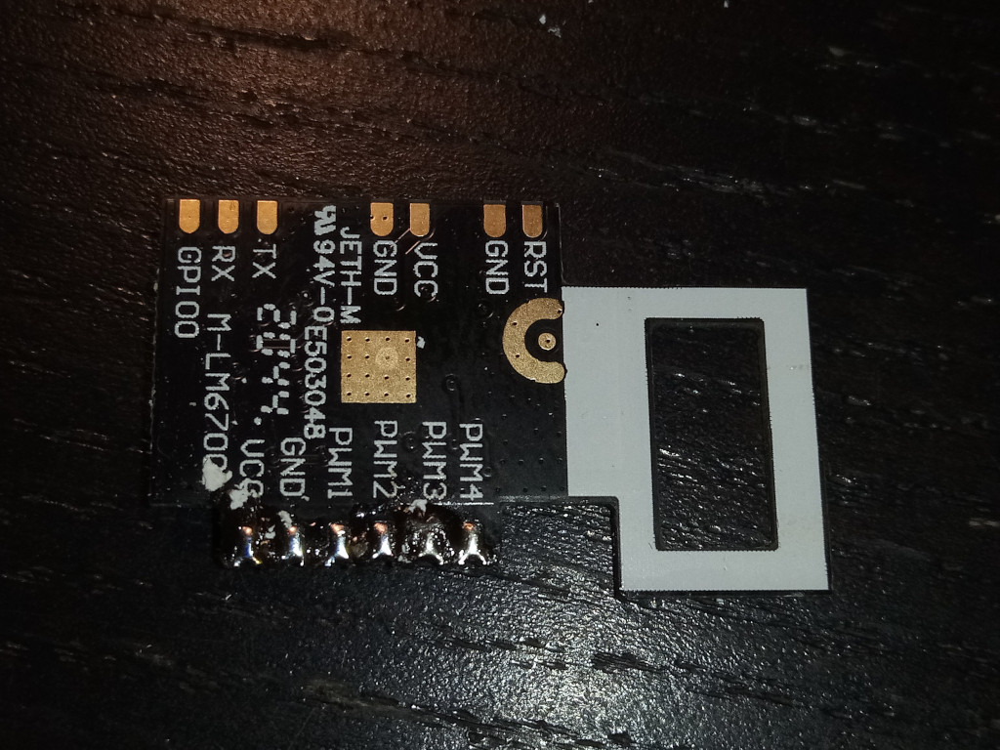

# Mi Smart LED Bulb firmware

## Hardware

Xiaomi Mi Smart LED Bulb XMBGDP01YLK

| Main board connections	| ESP8266EX	|
|-------------------------------|---------------|
| PWM1 (brightness)		| GPIO5		|
| PWM2 (n/c)			| MTCK		|
| PWM3 (n/c)			| MTDI		|
| PWM4 (n/c)			| MTMS		|



## Toolchain & SDK

- Toolchain: https://dl.espressif.com/dl/xtensa-lx106-elf-gcc8_4_0-esp-2020r3-linux-amd64.tar.gz
- SDK: github.com:espressif/ESP8266_RTOS_SDK @ 0f200b46406642ffa590673e244bad06fc736016

## Build

```sh
export PATH=~/x/esp/xtensa-lx106-elf/bin:$PATH
export IDF_PATH=~/x/esp/ESP8266_RTOS_SDK
make menuconfig	# Example Connection Configuration  ---> WiFi SSID, WiFi Password
make flash
```

## Usage
```sh
curl 192.168.2.248:80/?br=80
```
